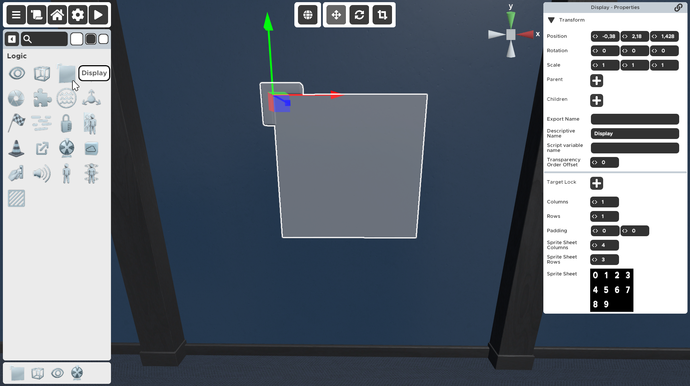

---

---

# Display

A display shows an image or grid of images from a configured sprite sheet. The display shows a particular image when fed an input from a lock.

## Properties

### :small_orange_diamond:Target Lock

	The lock that will define what images to be shown. As the values sent to the lock changes the display changes to images based on the numbers on the lock. If 0 is sent to the lock, it will display the first image in the sprite sheet. The "password" on the lock will show a preview on the display in the room editor.

### :small_orange_diamond:Columns

	The number of columns of images to be shown on the display.

### :small_orange_diamond:Rows

	The number of rows of images to be shown on the display.

### :small_orange_diamond:Padding

	The amount of horizontal and vertical padding between the shown images.

### :small_orange_diamond:Sprite Sheet Columns

	The number of columns in the linked sprite sheet. The display will slice the images evenly from the sprite sheet based on this number.

### :small_orange_diamond:Sprite Sheet Rows

	The number of rows in the linked sprite sheet. The display will slice the images evenly from the sprite sheet based on this number.

### :small_orange_diamond:Sprite Sheet

	An image containing rows / columns of images to be shown.

<!---
## Example

## 💡Tips
--->