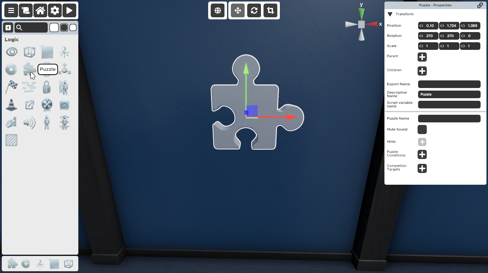

# Puzzle

The puzzle logic object allows you to mark players' progress, manage available walkthrough sections, and trigger events for other players in versus mode.

## How to set up puzzles

For every puzzle in your room, do the following:
- place one puzzle object and give it a meaningful name
- connect all previous puzzles that are required to solve this puzzle as puzzle conditions
- optional: create a walkthrough section, then connect it under hints
- optional: create in-game hints and catch-up effects for versus mode (e.g. to show outlines of objects where they must be placed, or to remove obstacles), then connect these as competitor targets
- when the player solves the puzzle, send a signal to the puzzle object

## Effects of puzzles

### In Single player mode
- a sound will play
- all its walkthrough sections will be hidden (unless other active puzzles also list them)
- the competitor targets will be triggered (bug)
- on solving all puzzles listed as conditions, connected walkthrough sections are made available

### In co-op mode
- same as single-player mode
- a message will be shown to all players "PLAYER NAME" has solved "PUZZLE NAME"

### In versus mode
- a sound will play
- a message will be shown to all players: "PLAYER NAME" has solved "PUZZLE NAME"
- all its walkthrough sections will become visible **for competitors** that have not solved the puzzle yet, and have fulfilled their conditions
- all its competitor targets will be triggered **for all players** (competitors and for active player)

## Properties

### :small_orange_diamond:Puzzle Name

The name displayed when a puzzle is solved. Leave empty to show no message.

### :small_orange_diamond:Mute sound

When checked, no sound will be played when a puzzle is solved

### :small_orange_diamond:Hints

Connects any number of walkthrough sections (use + to add more) - see effects of puzzles above for behaviour in different play modes

### :small_orange_diamond:Puzzle conditions

Connect to all puzzles that must be solved for this puzzles to be available or solvable

### :small_orange_diamond:Competitor targets

A signal (1) is sent to these targets by the puzzle when it's solved. In co-op, they are triggered for opponents. In single player, they are triggered for the triggering player

## 💡Tips
:::tip
To avoid triggering competitor targets for the active player (who has already solved the puzzle), route the signal from the puzzle through a lock (password 0,1). Connect the puzzle to pin 2, and connect the event that triggers the puzzle to pin 1.
:::

:::tip
A puzzle with no condition will reveal its hints at the beginning of the room. If you want to reveal them after other events (for example, when entering a room), use an additional puzzle as condition. Mute that puzzle's sound and leave its name empty, and trigger it when the real puzzle is reached.
Note that this dummy puzzle will still appear in the puzzle count for versus mode.
:::
