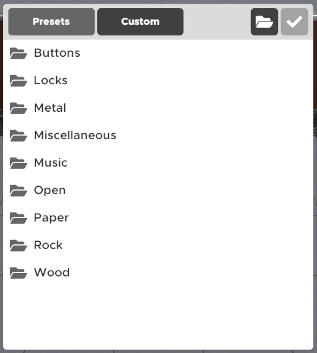

---

---

# Sound

The game allows for the adding of custom sounds. Sounds get activated with an activation input from a button, a trigger field, lock or a slot. They can be activated by animations.

The Sound Logic prop is the only way to add sounds to your rooms. Choose from a preset library or add your own. 

:::note
The Room Editor supports <i>.mp3</i>, <i>.ogg</i>, <i>.wav</i> and <i>.aiff</i> files. The use of <i>.mp3</i> or <i>.ogg</i> is recommended, since they are compressed (contrary to <i>.wav</i>) and will help to keep the file-size of the room small.
:::

:::tip
If some of your puzzles rely on sounds, notify the player at the start of the room or when they get to that puzzle so they know they should turn the sounds on! It's also good practice to offer visual alternatives for all sound puzzles.
:::

:::tip
A good free audio editing tool is [Audacity](https://www.audacityteam.org).
:::

## Properties

### :small_orange_diamond:Asset

	Select one of the preset sounds or a custom sound from the room folder.

Clicking this option will open a sound selection panel.

 

Here you can preview and choose a sound from the 'Presets' tab or add you own custom sounds. Choosing a sound preset from the game library will result in some of the settings being disabled by default. If you want to change some of those settings you will have to import your own custom sound.

To add custom sounds open your UGC Room folder () and place your custom sound files in that folder. The Room Editor supports <i>.mp3</i>, <i>.wav</i>, <i>.ogg</i> and <i>.aiff</i> files. Choosing a custom sound file as a source for the Sound Logic prop will result in more settings becoming available.

:::note
Each preset sound comes with it's own sound settings.
:::

:::tip
If you cannot hear a sound you imported, make sure you don't have your in-game music or sounds turned off!
:::

### :small_orange_diamond:Is Music

	When checked, the sound will be played on the music track. Only one 'Is Music' sound can play at a time.

If checked, the sound is marked as music and is played on the music bus. Music sounds can only play one at a time, so triggering another Sound prop marked as music will stop the previous one and play the last triggered one. Music sounds are looped.

If not checked, the sound is marked as a regular sound and is played on the effects bus. These sounds can be played over each other and the music bus, and more sound settings are available for them.

:::tip
Some people have turned the music in their games off or low, so important hint sounds or cues should not be tagged as music.
:::

### :small_orange_diamond:Is Loopable

	When checked, the sound will replay itself. Turn the sound off by reactivating the sound prop.

If checked, the sound will replay itself indefinitely. Activating this sound again will stop the sound completely.

If not checked, the sound will play only once. Activating a non looping sound twice at the same time will result in the sound playing twice at the same time.

### :small_orange_diamond:Is 2D

	When checked, the sound is played directly in the audio-output device. When not checked, the sound is directional.

If checked, the sound will be heard uniformly across the entire room.

If not checked, the sound will come from the position of the Sound Logic prop.

:::note
Changing the position of the prop will only change the position of the sound if the sound is played again.
:::

### :small_orange_diamond:Volume Scale

	Determines the volume of the sound.

Change the value to change the sound volume. Default is set to 1.

:::tip
The higher the Volume Scale value, the more the background music gets muted while the non-music sound asset gets played.
:::

### :small_orange_diamond:Active On Start

	When checked, this sound is activated as soon as the player starts the room. Only one 'Is Music' can play at the start.

If checked, the Sound Logic prop will be triggered as soon as the game begins.

If not checked, the prop will remain silent until triggered by e.g. an animation or a button.
