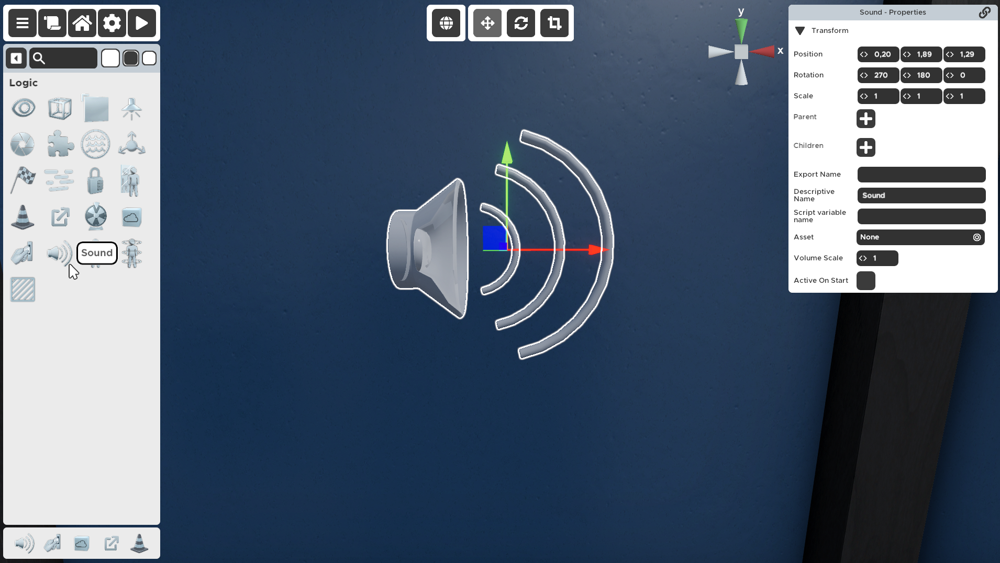

---

---

# Sound

The game allows for the adding of custom sounds. Sounds get activated with an activation input from a button, a trigger field, lock or a slot. They can be activated by animations.

## Properties

### :small_orange_diamond:Asset

Here you choose either one of the "Presets" sounds that are already in the game or you choose a custom sound file. This soundfile needs to be located in your room folder. The Presets will not allow you to change the options aside of "active on start" and "volume scale".

### :small_orange_diamond:Is Music

The sound is counted as music and is controlled by the music volume. Some people have turned the music in their games off or low, so important hint sounds or cues should not be tagged as music. Turning on another "is music" sound will make the previously played one fade out and the new one fade in. Retriggering the same in-built music again will make the next track of it play.

### :small_orange_diamond:Is Loopable

Sound will be looped. If you re-activate a loopable sound, it will stop. If you reactivate a not-loop sound, it will play again. It will play on top of itself, it the first play is not finished at that point.

### :small_orange_diamond:Is 2D

2D sound is played directly in the audio-output device. 3D sound (this option not activated) will be directional.

### :small_orange_diamond:Volume Scale

Only affects 3D: It sets how loud the sound is when farther away. Affects 2D and 3D: The higher the Volume Scale value, the more the background music gets muted while the non-music sound asset gets played. [Thanks to Wollo for spotting the second effect!]

### :small_orange_diamond:Active On Start

The sound will start after the player starts the level.

## 💡Tips
- As with custom images, keep the file size and copyright in mind. 
- Accepted file types are mp3, ogg, wav, flac and most other popular file types.
- The use of OGG or MP3 is recommended, since they are compressed (contrary to wav) and will help to keep the file-size of the room small. 
- A good free audio editing tool is [Audacity](https://www.audacityteam.org).
- You can find free audio effects on many websites. Most of them require you to make an account though.

### Trouble Shooting
- If you cannot hear a sound you imported, make sure you don't have your in-game music or sounds turned off!
- If a format doesn't work, try another one.