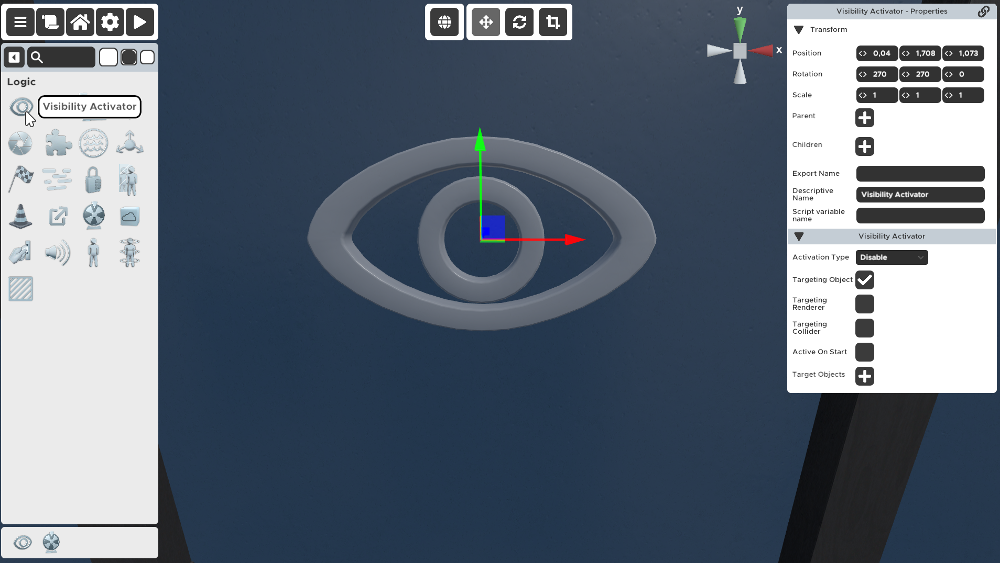

---

---

# Visibility Activator

A logic object that when sent an input will toggle the target objects themselves, toggle their colliders, or toggle their renderer. An activator will toggle properties of its targets if it is sent an output signal from a Button, Animation, Lock, Trigger or other logic objects.

## Common uses
- Hide an object until after a lock is unlocked or a puzzle is solved
- Hide effects until you want to display them later
- Hide many objects to keep performance higher in an area a player has not yet explored
- Disable the collider of an object so that everything will pass through it
- Make a player drop an item

## Properties

### :small_orange_diamond:Activation Type
> Determines whether to enable or disable a target property (object/renderer/collider) when it is triggered.

There are 3 types:
- `Disable`: Always disable the targeted properties of all targets.
- `Enable`: Always enable the targeted properties of all targets.
- `Toggle`: If the target property is enabled disable it. If it's disabled enable it. Always takes the current state of the target property into consideration and does the opposite.

### :small_orange_diamond:Targeting Object
> Defines whether the Activator Component should enable/disable/toggle the entire `Object`. This includes disabling the props's Renderer and Collider as well as all of the Child prop `Objects`.

You can disable a prop's `Object` property instead of targeting the Renderer and Collider to disable it completely. Also you can change the state of the Renderer and Collider properties even while the `Object` is disabled with another Visibility Activator but the changes will be visible only after the `Object` is enabled again.

Disabling the object will remove the prop from zooms, slots and inventories (this includes the trash inventory).

### :small_orange_diamond:Targeting Renderer
> Defines whether the Activator Component should enable/disable/toggle the rendering components of a prop. When the rendering components of a prop are disabled you can not see the prop but its physics properties remain unchanged.

### :small_orange_diamond:Targeting Collider
> Defines whether the Activator Component should enable/disable/toggle the collider (physics collision) components of a prop.

Disabling Colliders on a prop that is not static results in the prop falling through the floor.

Disabling Colliders on a prop that is static means it will not interact with other props using physics, e.g. you can throw other props through it.

Does not deactivate the Obstacle property.

### :small_orange_diamond:Active On Start
> Defines whether the Activator Component should activate on the first frame of starting the level.

### :small_orange_diamond:Target Objects
> List of props you want to enable/disable/toggle once the Activator Component is activated.

## 💡Tips
- Disabling a property of an object while it is in a player inventory or in a slot will make the player drop the prop on the player's current location and disable the Targeted properties of the prop.
- If none of the Targeting checkmarks are checked the Activator Component goes through the list of Targeting Objects but does nothing to the objects. 
