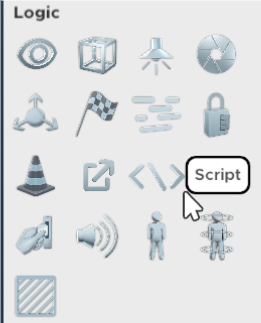
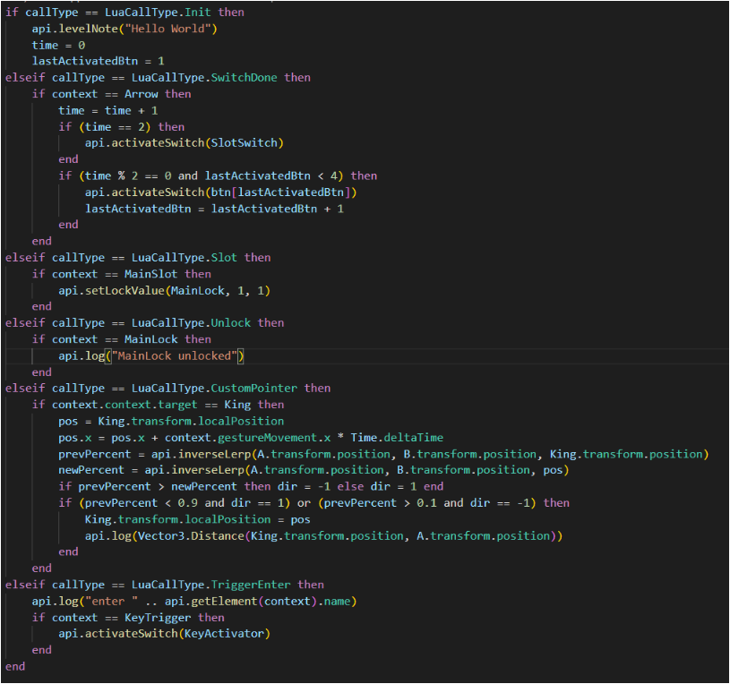
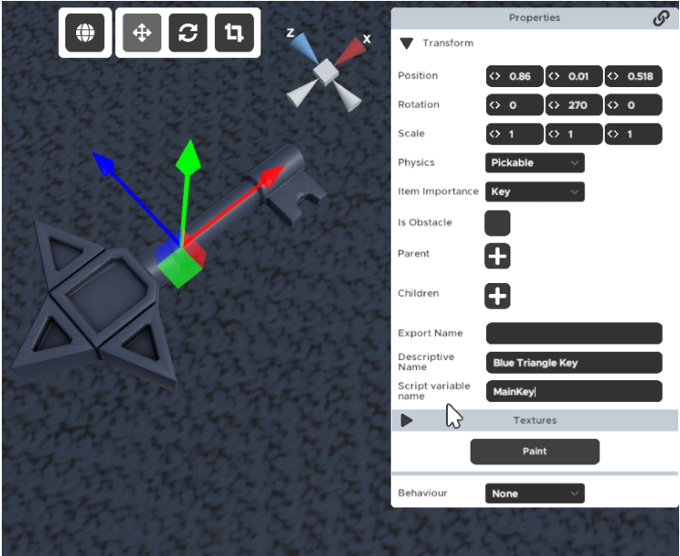
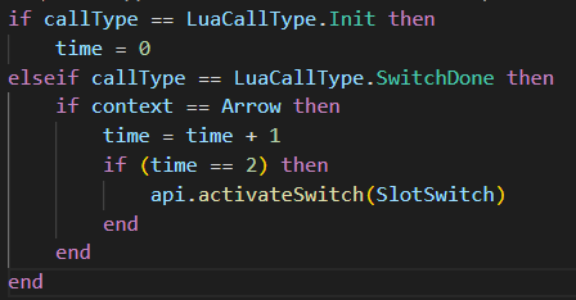

# Lua Scripting
In the Escape Simulator's Room Editor, you can add dynamic behaviors to your rooms in 2 ways. The default way of connecting objects, and the new Scripting way. You can even mix the two approaches if you need to. The code you will write is [Lua 5.2](https://www.lua.org/manual/5.2/) and is interpreted using [Moonsharp](https://www.moonsharp.org/about.html) interpreter.

## Script Object
In Room Editor, Scripting is exposed using a Logic element “Script”. When you place the object on the scene, you will have to attach a .lua script to it. In the Properties UI you can create a script if you don’t have one.
When you have selected a script, you can click the folder icon to open it in a text editor.

The object has the same attributes as any other, most importantly, visibility. While the Script object is visible, the code will run. The moment it turns invisible, the code stops executing. This allows more flexibility which code should run and when.

## Script organization
The code is written in a .lua file and has to have a specific organization. The game fires events when something happens and executes the whole lua file. Because of that, we have to catch specific events and execute the code for them.

In the code example, you can see the way the code is organized. When the game fires an event, callType holds the event ID. So we can check the callType and execute specific code for its type.

# Variables & Events

## Room object references
To start scripting, you need references to the object in your room. To do that, simply name the variable that will hold the reference to the object. It will automatically be linked to every Script and you can use it in the code.

Here we can see a key with variable name “MainKey”.

## Arrays
You can create arrays of room objects. To do that, after the name, add {x} where x is number in the array. E.g. 3 items with “Script variable name” defined as “Key{1}”, “Key{2}”, “Key{3}” will create an array (or Table in Lua) of 3 items. “Key{1}” will be the first element in the array and “Key{3}” will be the third. In the code, access the elements using indexer “[]” e.g. “Key[1]”, “Key[2]” and “Key[3]” will return “Key{1}”, “Key{2}” and “Key{3}” respectively.

## Custom lua variables
Sometimes you will have to define a variable in the code and use it throughout the playtime. To define such a variable, simply name the variable and set its value in the LuaCallType.Init chunk of code. Then you can use it in other places as well.

Here we can see a time variable that is incremented every time an “Arrow” switch is done. When the variable is 2, it activates another switch.

## Built-in variables & Events
When an event is fired from the game and before the lua script is called, additional variables are set. Most of the variables are the same for every event, but there are some differences.
We have next events and variables:
* Always present
This variables are present in every call:
  * callType (LuaCallType)
  * Time ([UnityEngine.Time](https://docs.unity3d.com/ScriptReference/Time.html))
  * Vector3 ([UnityEngine.Vector3](https://docs.unity3d.com/ScriptReference/Vector3.html))
  * Vector2 ([UnityEngine.Vector2](https://docs.unity3d.com/ScriptReference/Vector2.html))
  * api ([LuaAPI](#api-object))
* Init
  * Called once at the start of the level

* Update
  * Called every frame

* OnEnable
  * Called when the object becomes visible using Activator object

* OnDisable
  * Called when the object becomes invisible using Activator object

* SwitchStarted
  * context ([Switch](#api-object))
  * Holds a reference to a Switch that has started.

* SwitchDone
  * context ([Switch](#api-object))
  * Holds a reference to a Switch that has finished.

* Unlock
  * context ([Lock](#lock))
  * Holds a reference to a Lock that has been unlocked.

* TriggerEnter
  * context ([Trigger](#trigger))
  * Holds a reference to a Trigger that has been triggered.

* TriggerExit
  * context ([Trigger](#trigger))
  * Holds a reference to a Trigger that has been triggered.

* CustomPointer
  * context ([Pointer](#pointer))
  * Holds a reference to a Pointer and all of the data of the current interaction.

* ChatCommand
  * Context (String)
  * Holds the text a player has written in the command.
  * Players can enter commands in chat using “/”. 
    * E.g. writing “/clap”, in context object you will receive “clap”

* OnActivator
  * context ([ActivatorComponent](#activatorcomponent))
  * Holds a reference to a ActivatorComponent that has been triggered
  
## Switch & Lock
Most of the logic items have Switch or Lock in them, but are masked so it is easier for the creators to use them.

The objects that are actually Switch and can be used in SwitchStarted and SwitchDone are:
* Finish
* OpenLink
* Animation (Behaviour)
* Button (Behaviour)

The objects that are actually Lock and can be used in Unlock are:
* Post Processing
* Finish
* OpenLink
* Lock
* Skybox
* Sound
* Fog
* Teleport

## api object
At any time you have access to a special object: api. It is a bridge between our internal code and your lua code. It holds utility functions that can be used to help you write code and to add more features to your level.

Functions of api object:
* void log(string data)
  * Prints some debug information during development. If you call this while players are playing your room, nothing will happen

* void levelNote(string data)
  * Prints a levelNote for the players during their play session. Use this to give them hints or notes.

* void setLockValue(Lock lock, int value, int index)
  * Sets a value to a specific lock. Value can be anything, index starts from 1.

* void activateSwitch(Switch targetSwitch)
  * Activates a switch

* Element getElement(Monobehaviour target)
  * Gets the Element data of any object. Useful for changing the name of the objects or other data.

* Vector2 vector2(float x, float y)
  * Constructs a new Vector2 object with x and y values.

* Vector3 vector3(float x, float y, float z)
  * Constructs a new Vector3 object with x, y and z values.

* float inverseLerp(Vector3 a, Vector3 b, Vector3 point)
  * Returns a percent of point between Vectors a and b

* float map(float fromSource, float toSource, float fromTarget, float toTarget, float point)
  * Remaps a point from one range to another.
  * e.g. map(5, 10, 0, 1, 7.5) will return 0.5

* float getPercentBetween(float min, float max, float point)
  * Returns a percent a point is between min and max

* [Transform](https://docs.unity3d.com/ScriptReference/Transform.html)[] getAllPlayers()
  * Returns transform of all the players in the map

* Transform getMainPlayer()
  * Returns the object of singleplayer or host player transform

* Transform getLocalPlayer()
  * Returns the transform of the current player

* Transform getClosestPlayer(Vector3 position)
  * Returns the closest player to the given position

* void teleportPlayer(Transform targetPlayer, Vector3 location)
  * Teleports a given player to the location, preserving the rotation of the player before the teleport

* void toggleActivator(ActivatorComponent activator)
  * Toggles an activator. This will process the activator and enable/disable/toggle all of the objects defined by it.

* void add(ref GameObject[] array, GameObject newObject)
  * Adds the newObject object in the given array

* void remove(ref GameObject[] array, GameObject toRemove)
  * Removes the toRemove object from the given array

* bool contains(GameObject[] array, GameObject lookup)
  * Is the lookup gameObject present in the given array

* bool contains(Component[] array, Component lookup)
  * Is the lookup component present in the given array

# Types
In the code, you can acces all the variables of any object. Here are the variables of exposed types:

## Switch
* **bool isOn**: represents whether the switch is at the end or not.
* **bool goalIsOn**: represents the current direction of the switch. If isOn is different from goalIsOn, the switch is moving.
* **float duration**: Defines the duration of the switch
* **int outputValue**: Number that will be sent to the targeted props on correct completion

## Lock
* **int outputValue**: Number that will be sent to the targeted props on correct completion

## Slot
* **bool unlocked**: Is the slot unlocked with an item
* **bool canSwap**: Can the player swap items from the slot
* **GameObject insertedKey**: The item that is currently in the slot. Use api.getElement to get the correct reference in the code.
* **int outputValue**: Number that will be sent to the targeted props on correct completion

## Trigger
* **int outputValue**: Number that will be sent to the targeted props on correct completion
* **bool state**: is the trigger triggered currently

## Element
* **bool isKey**: is this item key item
* **bool isHint**: is this item a hint
* **bool isContainer**: is this item a container
* **bool isBook**: is this item a book
* **bool isTrashcan**: is this item a trash can
* **string elementName**: the name of this object that will be displayed

## Pointer
* **GameObject context.target**: the first object this pointer was pressed to
* **GameObject context.currentTarget**: the object this pointer is hovering above
* **Vector3 gestureFirstPosition**: The position in pixels where the pointer started
* **Vector3 gesturePositionViewport**: The current viewport position
* **Vector3 gesturePositionScreen**: The current screen position
* **Vector3 gestureMovement**: The movement delta from last frame
* **Vector3 gestureMovementTotal**: Total movement amount of this pointer

## ActivatorComponent
* **GameObject[] keys**: the keys that this activator targets
* **ActivatorType type**: The type of activator. Can be:
  * ActivatorType.disable
  * ActivatorType.enable
  * ActivatorType.toggle
* **bool targetObject**: Does this activator change the state of the objects (enabled or disables)
* **bool targetRenderer**: Does this activator change the state of the objects renderers (visible or invisible)
* **bool targetCollider**:  Does this activator change the state of the objects collider (active or inactive)